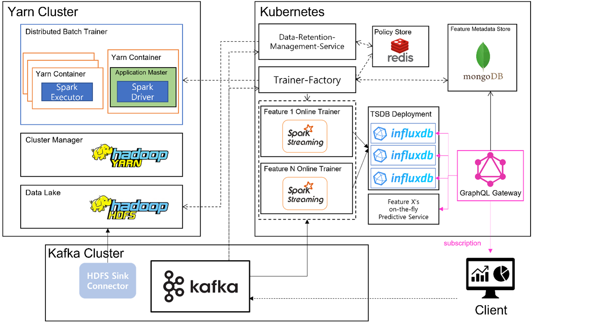
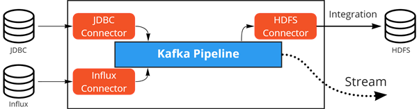
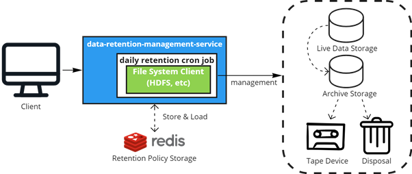
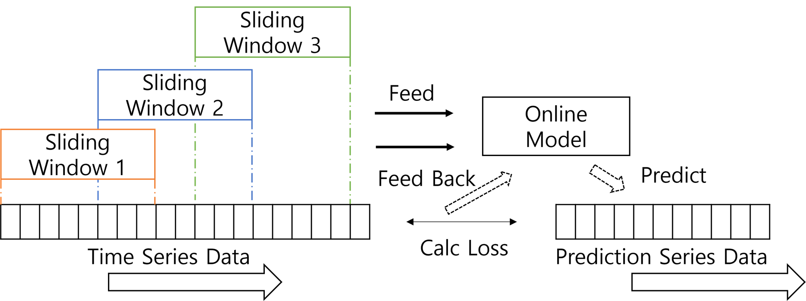
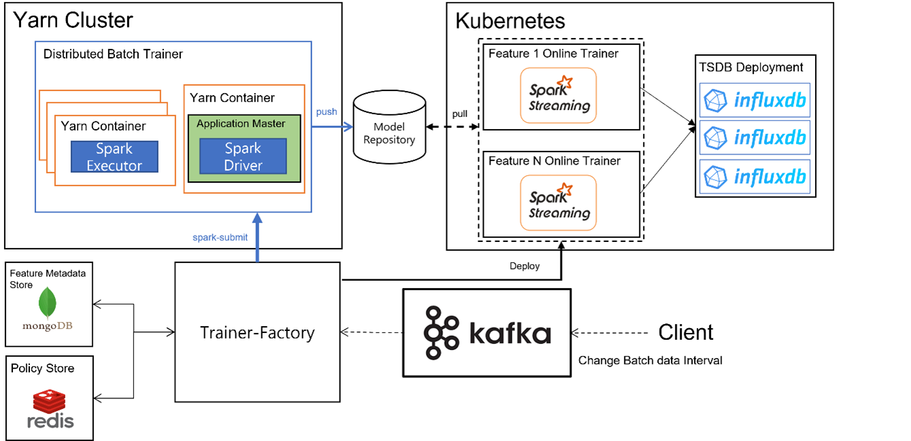
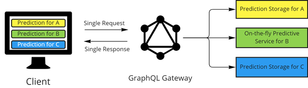

# Sparkhu

해당 리포지토리는 2022년 1학기 경희대학교 컴퓨터공학과 캡스톤디자인 1 수업의
### 실시간 및 배치 빅데이터 분석과 분산 학습을 지원하는 Spark와 Kafka를 사용한 AIOps 기반 아키텍처
프로젝트의 메인 리포지토리입니다.


## 1. 문제 정의
빅데이터 시대에 발빠른 데이터 처리 및 핵심 정보 도출 능력은 비즈니스 성패를 좌우합니다.<br>
다양한 (**V**ariety) 시각의 데이터를 가능한 많이 (**V**olume) 단시간 (**V**elocity) 내에 통합하고 처리하여, 정확한 (**V**eracity) 정보를 도출해내어 비즈니스에 가치 (**V**alue)를 더하는 작업은 <u>새로운 접근 방식</u>을 요구합니다.<br><br>
이러한 대형 시스템은 느슨한 상호의존성과 자동화된 운영능력을 갖추지 못하면 거대 데이터 폐기장에 불과합니다.

## 2. 프로젝트 소개
이 프로젝트는 여러 데이터 소스로부터 데이터를 쉽게 통합하고 관리하며,<br>
과거 데이터로부터 Offline 배치 분산학습을 지원하고, 생성된 모델을 Online  학습 모델의 Initiative로 활용하도록 제어하는 AIOps 기반 자동화 솔루션 제공을 목표로 합니다.<br><br>
따라서 해당 프로젝트를 통해 운영자의 인프라 관리 및 소프트웨어 관리 개입을 줄이고 시계열 데이터의 장기적 특징 및 트렌드를 잘 반영한 예측 서비스를 제공받을 수 있습니다.<br><br>

전체적인 그림은 다음과 같습니다.


※ 본 연구는 과학기술정보통신부 및 정보통신기획평가원의 SW중심대학 사업의 연구결과로 수행되었음 (2017-0-00093) 지도교수: 허의남

## 3. 프로젝트 내용
### 2.1 프로젝트에 활용한 데이터
 제시된 프로젝트에서는 오픈 시계열 데이터셋 [AMPds2](https://dataverse.harvard.edu/dataset.xhtml?persistentId=doi:10.7910/DVN/FIE0S4) 를 활용하였습니다. <br>
 선정 이유는 temporal resolution이 minutely이며 결측값이 없는 high quality resoltion 이기 때문입니다.<br><br>
 해당 데이터는 2012년 4월부터 2014년 3월까지로 과거 데이터이기 때문에 프로젝트에서 실시간 및 배치 운영능력을 검증하기 위해 시간축 평행이동을 진행하였습니다. [해당 리포지토리](https://github.com/Sparkhu/timeseries_parallel_traslator)를 참조하세요.
 ##### 기존 데이터
 | 관측 시작(Unix Timestamp) | 관측 시작(UTC, RFC 3339) |  관측 종료(Unix Timestamp)   |  관측 종료(UTC, RFC 3339)   |
| :--------: | :--------: | :------: | :-----: |
|   `1333263600`    |   2012-04-01T07:00:00Z    | `1396335540` | 2014-04-01T06:59:00Z |
 ##### 시간축 평행이동 후
 | 관측 시작(Unix Timestamp) | 관측 시작(UTC, RFC 3339) |  관측 종료(Unix Timestamp)   |  관측 종료(UTC, RFC 3339)   |
| :--------: | :--------: | :------: | :-----: |
|   `1609398000`    |   2020-12-31T07:00:00Z    | `1672469940` | 2022-12-31T06:59:00Z |

### 2.2 Kafka Connect를 이용한 데이터 통합
 Kafka는 고성능 처리능력을 가진 메시지 전달 시스템으로 빅데이터 통합을 위해 활용하였으며 특히 Kafka Connect는 다양한 오픈 소스 Connector를 plugin형식으로 지원함으로써 쉽게 데이터 소스로부터 데이터를 Polling할 수 있습니다.


Connector Provider에 의해 제공된 설정값을 customizing하며 쉽게 구성가능하며 REST API를 통해 Connector를 Kafka에 등록할 수 있습니다.<br>

#### Influxdb Source Connector REST API 등록 요청 예시
```curl
curl --location --request POST 'http://{Kafka Connect REST API addr}/connectors' \
--header 'Content-Type: application/json' \
--data-raw '{
    "name": "mock_data_rewinder",
    "config": {
        "connector.class" : "io.confluent.influxdb.source.InfluxdbSourceConnector",
        "influxdb.url" : "{influxdb connection url}",
        "topic.prefix" : "AMPds2_tests_",
        "topic.mapper" : "measurement",
        "influxdb.db": "AMPds2",
        "mode" : "timestamp"
    }
}'
```
#### HDFS3 Sink Connector REST API 등록 요청 예시
```curl
curl --location --request GET 'http:// ://{Kafka Connect REST API addr}/connectors/' \
--header 'Content-Type: application/json' \
--data-raw '{
    "name": "mock_data_hdfs_sink",
    "config": {
        "connector.class" : "io.confluent.connect.hdfs3.Hdfs3SinkConnector",
        "hdfs.url": "hdfs://{HDFS Namenode addr}",
        "hadoop.home" : "/usr/local/hadoop",
        "hadoop.conf.dir" : "/usr/local/hadoop/etc/hadoop",
        "topics" : "AMPds2_tests_electricity",

        "flush.size": 60,
        "key.converter": "org.apache.kafka.connect.json.JsonConverter",
        "key.converter.schemas.enable": true,
        "value.converter": "org.apache.kafka.connect.json.JsonConverter",
        "value.converter.schemas.enable": true,
        "confluent.topic.bootstrap.servers": "localhost:9092",
        "format.class" : "io.confluent.connect.hdfs3.json.JsonFormat",
        "topics.dir" : "/data",

        "partitioner.class" : "io.confluent.connect.storage.partitioner.DailyPartitioner",
        "path.format" : "'\''year'\''=YYYY/'\''month'\''=MM/'\''day'\''=dd/'\''hour'\''=HH",
        "timestamp.extractor" : "RecordField",
        "timestamp.field" : "time", 
        "locale": "ko_KR",
        "timezone": "Asia/Seoul",

        "consumer.override.auto.offset.reset": "earliest",
        "confluent.topic.replication.factor" : 1
    }
}'
```
### 2.3 데이터 보존 관리 서비스
앞서 언급한 것처럼 <u>데이터를 무한정 쌓으면 관리가 어려운 데이터 폐기장</u>이 되기 일쑤입니다.<br><br>
시스템이 가진 가용용량은 한계에 직면할 것이며 시스템 운영자가 겉잡을 수 없이 통합된 빅데이터는 수동으로 처리 불가한 수준에 도달하여 시스템 가용성을 제한합니다.<br><br>
이에 해당 프로젝트에서는 일반화된 데이터 보존 정책을 관리, 수행하는 서비스를 외부적으로 만들었습니다. [해당 리포지토리](https://github.com/Sparkhu/data-retention-management-service.git)를 참조하세요.<br>이제 자동화된 보존 관리 서비스에 의해 관리 지옥에서 벗어나고 일반화된 서비스로부터 자신의 스토리지 영역에 맞게 정책을 확장해 나갈 수 있습니다.


### 2.4 Spark엔진을 활용한 배치 분산 학습
지도학습은 SIMD구조의 처리 능력을 요구하는 Compuational 작업입니다.<br> 단일 노드 작업은 아무리 Scale up을 하더라도 캐싱 및 Disk I/O bottleneck, Single Point of Failure로 운영상 어려움을 직면하기 마련이며 빅데이터 학습 처리 속도 면에서 만족하기 어렵습니다.<br><br>
분산 컴퓨팅은 Commodity 하드웨어의 한계를 격파해주며 빅데이터 처리 시대에 꽤나 필수적인 요소로 자리잡고 있습니다. 하지만 OpemMP, MPI,  Synchronization, System Discovery 까지 저수준 분산 컴퓨팅 애플리케이션 개발은 개발자에게 큰 부담이며 디버깅조차 어려운 시스템 패망의 지름길입니다.<br><br>
따라서 우리는 분산 프레임워크계의 사실상 표준인 Spark Engine을 사용하여 분산 학습을 진행하였습니다. Spark 자체는 DNN 학습을 지원하지 않기에 이를 래핑한 [BigDL](https://github.com/intel-analytics/BigDL) 프로젝트를 적용하여 LSTM모델을 학습하였습니다. [해당 리포지토리](https://github.com/Sparkhu/batch_trainer)를 참조하세요.<br><br>

### 2.5 스파크 스트리밍을 활용한 온라인 학습
온라인 학습은 오프라인 학습과 다르게 실시간 데이터를 기반으로 모델을 최적화합니다. 우리는 스파크 스트리밍을 활용하여 실시간 시계열 데이터로부터 미니배치 Sliding Window를 구성하여 실시간 학습을 진행하였습니다. 또한 실시간 예측 데이터를 Prediction Storage 업데이트하도록 하였습니다. [해당 리포지토리](https://github.com/Sparkhu/online_trainer.git)를 참조하세요.


### 2.6 배치 학습과 온라인 학습을 연계하는 AIOps 서비스
오프라인 학습과 온라인 학습의 연계를 제어하는 자동화된 시스템은 AIOps의 핵심 기능을 담당할 것으로 기대됩니다. 이와 더불어 Feature Metadata Store를 제공하는 서비스는 Kafka Connect API로부터 데이터 소스를 등록하는 영역부터, 예측 데이터 저장소를 Indicator해주는 영역까지 시스템 전반에 걸쳐 중요한 정보 시스템 역할을 할 것으로 기대됩니다. <b>현재 해당서비스는 개발 전 단계에 있습니다.</b> 


### 2.7 SPA로 구현된 Client와 GraphQL Server의 연동
전형적인 Single Page Application은 필요한 컴포넌트 구성을 위해 여러 서비스로부터 데이터를 비동기적으로 불러옵니다. <b>이는 앞단에 특정 서비스 의존성을 부여하기 때문에 시스템이 확장함에 따라 부담감을 주게 됩니다.</b><br><br>
우리는 이에 따라 GraphQL Server로 구현된 예측 데이터 패치 Gateway를 제공하여 서비스 의존성과 멀티 사이드 패치의 책임을 위임하는 전략을 취했습니다. [해당 리포지토리](https://github.com/Sparkhu/prediction-gateway)를 참조하세요. <br><br>따라서 필요한 데이터를 단일 요청으로 유동적으로 불러올 수 있으며 앞단의 서비스 의존에 대한 책임을 덜게 되었습니다.<br><br>

또한 향후 GraphQL의 Subscription기능으로 전환하여 실시간 예측데이터를 비동기적으로 구독할 수 있도록 할 예정입니다.

### 2.8 예측 데이터와 보존 및 학습 정책을 관리하는 대시보드
시스템 고객에게 소통하여 예측 데이터를 제공받아 시각화하고 데이터 보존 및 학습 정책을 설정할 수 있는 대시보드 또한 제작하였습니다. [해당 리포지토리](https://github.com/Sparkhu/data-control-ui)를 참조하세요. (학습정책 관리는 2.6 서비스 개발 후 지원 예정입니다.)

## 3. 프로젝트 결과
### 3.1 분산 학습에 따른 학습 시간 감소
클러스터 단위 작업에 따른 성능 비교는 다음과 같습니다.
 | **Node Setting** | Local |  Cluster |  Local  |  Cluster |  Local  |  Cluster |
| :--------: | :--------: | :------: | :-----: | :-----: | :-----: | :-----: |
| **Epochs**| 1| 1| 100 | 100 | 1000 | 1000|
| **Avg of job**| 38.8| 24.6| 361.1 | 156.9 | 4007.2 | 1370.3|
### 3.2 Simple Exponential Smoothing 알고리즘을 적용한 예측 데이터 정확도 향상
시계열 데이터는 시간의 흐름에 따라 기록된 데이터를 의미하며 시간 지역적으로 특징이 나타냅니다. 우리는 시계열 데이터의 비교적 넓은 구간의 Trend와 짧은 구간의 Seasonal 변동을 잘 표현하는 LSTM 모델을 사용하여 학습을 진행하였고 다음 수식의 Simple Exponential Smoothing알고리즘을 적용하여 비교적 최신 예측이 과거의 데이터로 생성된 예측보다 더 큰 가중치를 적용받도록 하였습니다.
<p align="center">
  
</p>

### 3.3 인프라 자동화의 필요성 감지
우리는 Spark, Yarn, Hadoop, Kubernetes 클러스터 구성 및 운영 단계에서 각 노드마다 같은 명령을 입력하거나 에러를 처리하는 지옥에 갇혔고 Ansible, Chef 등 IaC 도구와 CI/CD 연계의 필요성을 절실히 느꼈다. 또한 작업이 많아짐에 따라 클러스터 성능이 현저히 저하되는 것을 경험하여 모니터링 시스템부터 시작해서 자동 리소스 조정 영역까지 인프라 관리 자동화의 필요성을 느꼈다. 추후 이러한 부분을 개선해 나갈 예정이다.

## 4. Contributor
|이름 |소속|담당|참여기간|
|------|------|------|------|
|안영민|경희대학교 컴퓨터공학과|Product Owner & Infra Manager|2022-03-10~|
|김서현|경희대학교 컴퓨터공학과|Web Design,Developer & Operator|2022-03-10~|
## 5. 라이센스
This project is licensed under the terms of the [**MIT license**](https://opensource.org/licenses/MIT) & [**APACHE LICENSE, VERSION 2.0**](https://www.apache.org/licenses/LICENSE-2.0.txt)..
